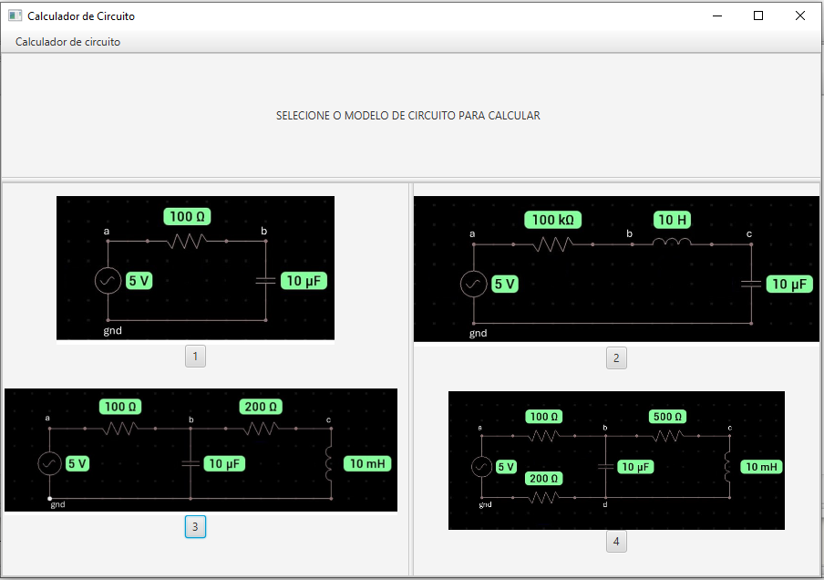

# Relatório Individual Projeto Final de Programação Orientada a Objetos

## 1. Ferramentas
Para este projeto utilizamos em sua maioria para fazer os códigos a IDE BlueJ que tem suporte a linguagem Java. Outro programa que foi bastante utilizado foi o Scene Builder para a criação da interface de maneira mais visual e gerar o arquivo fxml, que para ser lido e manipulado eu utilizei a plataforma IDE Apache NetBeans, que facilitou bastante a leitura e entendimento na hora de fazer a classe controller e view. Utilizamos também GitBash e WindowsPowerShell, para realizar os commites das correções das classes do projeto no repositor no GitHub.

## 2. Introdução
O objetivo inicial desse projeto era criar uma interface para calcular um modelo de circuito elétrico baseado nos componentes e valores que o usuário queria calcular, mas com o decorrer do projeto o meu companheiro João Victor que ficou encarregado de fazer as classes para cálcular o circuito, pois ele é o único do grupo que tem o conhecimento teórico necessário para fazer esses calculos, pois a maneira de calcular que ele propós só é apresentado na matéria de Circuito I, apresentado muito a frente no curso. Encontrou muitas dificuldades em fazer desse modelo, mas com empenho e estudo ele conseguiu achar um método para fazer o código calcular e chegarmos até o fim do projeto com um resultado satisfatório para o tempo que tinhamos.

## 3. Projeto

O meu grupo tinha apenas 3 pessoas então dividimos as tarefas da seguinte maneira: João que possuia o conhecimento teórico ficou responsável pela parte do codigo que iria fazer as contas do circuito e eu e o Viviano ficamos com o código das outras classes que fariam parte do circuito. Eu fiz as classes Impedancia e Capacitancia na etapa inicial do programa, mas devido à algumas alterações na classe que faz as contas, foram descartadas. Logo após para o programa já nas suas etapas finais fiz o código das Classes Capacitor, VSource e a classe abstrata CompPassivo. Essa classe CompPassivo ficou como abstrata pois ela possui os atributos e métodos comuns as classes dos outros componentes.

## 4. Interface 
A inteface foi feita por mim e pelo Viviano em sua maioria já que o João ficou com a parte de fazer o código de contas. A ideia inicial não foi atendida devido a complexidade da interface e o tempo era pouco, então descidimos reduzir para 4 modelos já feitos e já testados ficando assim a interface:

<div align="center">

  

</div>

O código fxml dela ficou assim:
```
<?xml version="1.0" encoding="UTF-8"?>

<?import javafx.scene.control.Button?>
<?import javafx.scene.control.Label?>
<?import javafx.scene.control.Menu?>
<?import javafx.scene.control.MenuBar?>
<?import javafx.scene.control.MenuItem?>
<?import javafx.scene.image.Image?>
<?import javafx.scene.image.ImageView?>
<?import javafx.scene.layout.AnchorPane?>
<?import javafx.scene.layout.VBox?>
<?import javafx.scene.control.SplitPane?>

<VBox xmlns:fx="http://javafx.com/fxml/1" xmlns="http://javafx.com/javafx/21" prefHeight="600.0" prefWidth="900.0">
  <children>
    <MenuBar VBox.vgrow="NEVER">
      <menus>
        <Menu mnemonicParsing="false" text="Calculador de circuito">
          <items>
            <MenuItem mnemonicParsing="false" text="Sair" />
          </items>
        </Menu>
      </menus>
    </MenuBar>
    <AnchorPane VBox.vgrow="ALWAYS">
      <children>
        <SplitPane dividerPositions="0.24083769633507854" layoutX="275.0" layoutY="141.0" orientation="VERTICAL" AnchorPane.bottomAnchor="0.0" AnchorPane.leftAnchor="0.0" AnchorPane.rightAnchor="0.0" AnchorPane.topAnchor="0.0">
          <items>
            <AnchorPane minHeight="0.0" minWidth="0.0" prefHeight="100.0" prefWidth="160.0">
              <children>
                <Label layoutX="301.0" layoutY="37.0" prefHeight="61.0" prefWidth="295.0" text="SELECIONE O MODELO DE CIRCUITO PARA CALCULAR" />
              </children>
            </AnchorPane>
            <AnchorPane prefHeight="387.0" prefWidth="629.0">
              <children>
                <SplitPane dividerPositions="0.5" layoutX="188.0" layoutY="71.0" AnchorPane.bottomAnchor="0.0" AnchorPane.leftAnchor="0.0" AnchorPane.rightAnchor="0.0" AnchorPane.topAnchor="0.0">
                  <items>
                    <AnchorPane minHeight="0.0" minWidth="0.0" prefHeight="160.0" prefWidth="100.0">
                      <children>
                        <ImageView fx:id="circ1" fitHeight="163.0" fitWidth="392.0" layoutX="59.0" layoutY="14.0" pickOnBounds="true" preserveRatio="true">
                          <image>
                            <Image url="@imagens/Circuito_RC.jpg" />
                          </image>
                        </ImageView>
                        <Button fx:id="but3" layoutX="200.0" layoutY="364.0" mnemonicParsing="false" onAction="#clickC3" text="3" />
                        <ImageView fx:id="circ3" fitHeight="142.0" fitWidth="431.0" layoutX="2.0" layoutY="225.0" pickOnBounds="true" preserveRatio="true">
                          <image>
                            <Image url="@imagens/Circuito_3.jpg" />
                          </image>
                        </ImageView>
                        <Button fx:id="but1" layoutX="200.0" layoutY="177.0" mnemonicParsing="false" onAction="#clickC1" text="1" />
                      </children>
                    </AnchorPane>
                    <AnchorPane minHeight="0.0" minWidth="0.0" prefHeight="160.0" prefWidth="100.0">
                      <children>
                        <ImageView fx:id="circ2" fitHeight="239.0" fitWidth="446.0" layoutY="14.0" pickOnBounds="true" preserveRatio="true">
                          <image>
                            <Image url="@imagens/Circuito_RLC.jpg" />
                          </image>
                        </ImageView>
                        <Button fx:id="but4" layoutX="211.0" layoutY="380.0" mnemonicParsing="false" onAction="#clickC4" text="4" />
                        <ImageView fx:id="circ4" fitHeight="152.0" fitWidth="398.0" layoutX="38.0" layoutY="228.0" pickOnBounds="true" preserveRatio="true">
                          <image>
                            <Image url="@imagens/Circuito_4.jpg" />
                          </image>
                        </ImageView>
                        <Button fx:id="but2" layoutX="211.0" layoutY="179.0" mnemonicParsing="false" onAction="#clickC2" text="2" />
                      </children>
                    </AnchorPane>
                  </items>
                </SplitPane>
              </children>
            </AnchorPane>
          </items>
        </SplitPane>
      </children>
    </AnchorPane>
  </children>
</VBox>
```
Assim com isso foi desenvolvido a classe view e controller utlizado no método MVC, desenvolvi a maior parte do código com mas o Viviano me ajudou a perceber alguns erros, mas outros tive que procurar como alguns imports diferentes para facilitar como a ação de um botão e de trocar tela no final. A classe do CircController que eu fiz foi um desafio de fazer ela fazer o que eu queria juntamente com a classe CircView, no final não consegui corrigir a ação de ativar a tela secundária mas pelo menos estáva aparecendo no terminal do BlueJ.
O código da classe CircController:
```java
import javafx.event.ActionEvent;
import javafx.fxml.FXML;
import javafx.scene.control.Button;
import javafx.scene.image.ImageView;
import javafx.stage.Stage;

public class CircController {
    CircView circView;
    Stage stage;
        
    @FXML
    private Button but1;

    @FXML
    private Button but2;

    @FXML
    private Button but3;

    @FXML
    private Button but4;

    @FXML
    private ImageView circ1;

    @FXML
    private ImageView circ2;

    @FXML
    private ImageView circ3;

    @FXML
    private ImageView circ4;
    
    public CircController() {
        this.circView = new CircView();
        this.circView.setController(this);
    }
    
    void initialize() {
        
    } 
    
    public void iniciar() throws Exception {
        this.circView.start(this.stage);
        this.stage.show();
    }
        
    @FXML
    public void clickC1(ActionEvent e) {
        Circ1.execute(new String[]{});
    }

    @FXML
    public void clickC2(ActionEvent event) {
        Circ2.execute(new String[]{});
    }

    @FXML
    public void clickC3(ActionEvent event) {
        Circ3.execute(new String[]{});
    }

    @FXML
    public void clickC4(ActionEvent event) {
        Circ4.execute(new String[]{});
    }
}
```
CircView:
```java
import javafx.application.Application;
import javafx.fxml.FXMLLoader;
import javafx.scene.Parent;
import javafx.scene.Scene;
import javafx.stage.Stage;
import java.io.File;
import java.net.URL;
import javafx.scene.layout.Pane;
import javafx.scene.layout.AnchorPane;


public class CircView extends Application {
    private FXMLLoader loader;
    private URL url;

    public CircView() {
        this.loader = new FXMLLoader();
        try {
            // Ajuste o caminho do arquivo FXML conforme necessário
            this.url = getClass().getResource("/INTERF.fxml");
            if (this.url == null) {
                throw new Exception("Arquivo FXML não encontrado");
            }
            this.loader.setLocation(this.url);
        } catch (Exception e) {
            System.out.println("Erro na carga da FXML: " + e);
        }
    }

    public void setController(CircController controller) {
        this.loader.setController(controller);
    }

    @Override
    public void start(Stage primaryStage) throws Exception {
        try {
            // Defina o controlador aqui
            CircController controller = new CircController();
            this.loader.setController(controller);

            Parent root = loader.load();
            Scene scene = new Scene(root);
            primaryStage.setScene(scene);
            primaryStage.setTitle("Calculador de Circuito");
            primaryStage.show();
        } catch (Exception e) {
            System.out.println("Erro ao carregar o FXML: " + e);
            e.printStackTrace();
        }
    }

    public static void main(String[] args) {
        launch(args);
    }
}
```

## 5. Conclusão

Esse projeto foi sem dúvidas muito desafiador, não so na parte lógica mas ainda mais na parte de como passar os comandos de maneira correta para o programa fazer as contas de maneira precisa. Mas sempre que precisava de ajuda meu colegas de grupo me ajudavam com podiam, mesmo tendo sido estressante em alguns momentos quando o programa não entendia como era pra fazer as contas ou como era pra executar tal ação, é muito bom ver o resultado final funcionando tudo encaixado, tivemos que alterar bastante a nossa ideia inicial mas acredito que a essência do projeto ainda é a mesma.
