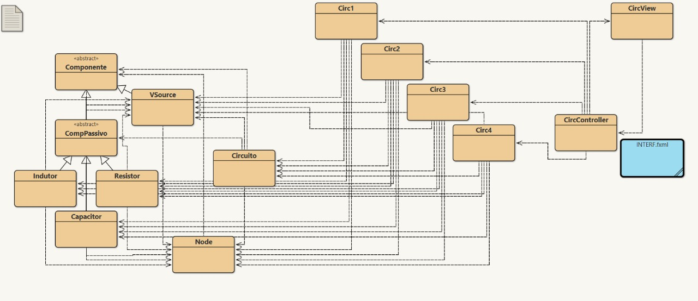
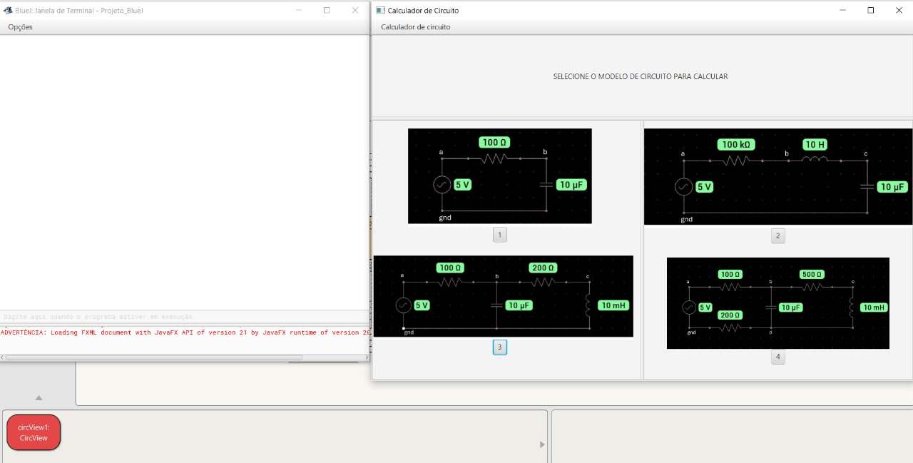

# Projeto de Simulação de Circuitos Elétricos
**Grupo: 7**  
**Integrantes/papéis:**  
João Victor Ferro / Líder, coordenador de desenvolvimento back-end, dev back-end, tester/validação  
Theodoro Costa Modesto / Dev back-end, dev front-end  
Viviano Acosta / Dev back-end, dev front-end

## Introudução

A análise de circuitos elétricos é uma das disciplinas mais subestimadas dos cursos de Engenharia Elétrica por parecer simples a primeira vista. 
No entanto, com o passar dos dias e ao passo que o professor avança com o conteúdo, as coisas podem se tornar difíceis, principalemente quando o 
tema avança para análise de circuitos no regime de corrente alternada. Esta simples mudança leva os alunos a terem que aprender conceitos matemáticos 
novos, de domínio da frequência, fasores, além de exigir um bom trato com o tema de números complexos e álgebra linear para resolver os complicados
sistemas lineares aos quais levam a resolução de algumas questões comuns, das quais nem sempre é possível ter acesso à solução para conferência de 
resultados.  
É pensando nesta dificuldade que o nosso grupo idealizou uma aplicação que seja capaz de ajudar os alunos a conferir os resultados dos cansativos 
cálculos desenvolvidos.  
Devendo usar a linguagem de programação Java, escopo da disciplina de Programação Orientada a Objetos do curso de Engenharia Elétrica da UFG, nos
propusemos a desenvolver uma aplicação que seja capaz de simular circuitos elétricos lineares (que só contém componentes lineares, como resistores
capacitores e indutores), apresentando os resultados com precisão e rapidez.  
Com o escopo geral do problema definido, por simplicidade, nos focamos em desenvolver um código capaz de modelar satisfatoriamente circuitos
lineares com uma fonte de tensão independente via análise nodal no domínio da frequência.

## Plano
  **Objetivo geral:** desenvolver uma aplicação em arquitetura MVC que seja capaz de receber a topologia de circuito desejada, assim como os parâmetros
                      dos componentes e devolver ao usuário, de maneira simples, os resultados da simulação.  
  **Objetivos específicos:**   
                               1. Desenvolver o modelo de classes básicas dos componentes a serem aplicados à simulação  
                               2. Desenvolver a metodologia adequada de tratamento dos componentes no domínio da frequência  
                               3. Desenvolver elementos de conexão e interação entre os componentes básicos  
                               4. Desenvolver o modelo adequado para definição da topologia do circuito  
                               5. Desenvolver a metodologia de resolução do circuito via análise nodal  
                               6. Desenvolver a interface gráfica adequada para seleção e impressão dos resultados  
                               7. Desenvolver a integração entre a interface gráfica e o modelo com arquitetura MVC  

## Tarefas 
De acordo com o papel de cada membro dentro do grupo, inicialmente foram atribuídas as seguintes tarefas a cada um:  

- João Victor: desenvolver adequadamente algumas classes básicas do projeto e coordenar o desenvolvimento de outras por parte dos outros integrantes; 
produzir a documentação adequada para as classes básicas desenvolvidas; coordenar o desenvolvimento da metodologia de tratamento dos componentes no 
domínio dafrequência; desenvolver os elementos de conexão e interação dos componentes; desenvolver o modelo de definição de topologia e resolução do 
sistema.  

- Theodoro: desenvolver adequadamente algumas classes básicas do projeto; produzir documentação adequada para as classes desenvolvidas; cooperar no
desenvolvimento da interface gráfica; cooperar no desenvolvimento da integração GUI/model com arquitetura MVC.

- Viviano: desevolver adequadamente algumas classe básicas do projeto, produzir documentação adequada para as classes desenvolvidas, cooperar no
desenvolvimento da interface gráfica; cooperar no desenvolvimento da integração GUI/model com arquitetura MVC.
  
## Modelagem inicial
O diagrama UML completo das classes básicas do modelo pode ser visualizado a seguir
  
Já o diagram UML simplificado de todas as classes do projeto e arquivo fxml, gerado pelo BlueJ está a seguir
  
Abaixo deixo registradas as instruções de como iniciar a aplicação criada:  
- Com o arquivo package aberto e compilado para todas as classes, basta selecionar a classe CircView, expor o menu de opções com um clique no botão
direito do mouse, e selecionar a opção "Executar aplicação JavaFX"

- Aguardando um pouco, devem abrir duas janelas: uma do terminal do BlueJ e outra da própria aplicação

- Na tela da aplicação o layout de cada opção é formado por uma imagem da topologia do circuito e por um botão, que faz com que seja disparada a
solução do circuito especificado

- Ao acionar o botão a solução do circuito aparecerá na janela do terminal  

Não é necessário se preocupar com as matrizes e vetores que aparecem junto ao resultado, eles estão ali para conferência de coerência do modelo.
O resultado propriamente dito da simulação é representado pelas tensões nodais para os nós do circuito selecionado, expressar na forma
magnitude /_ ângulo de fase V.  
Infelizmente não conseguimos fazer com que a aplicação possa ser reaberta depois de fechada. Para isso é necessário fechar projeto no BlueJ, abrí-lo
e executar a aplicação novamente repetindo o procedimento descrito acima.

## Considerações finais
Concluo como líder do grupo de desenvolvimento que o projeto cumpriu seu papel em trabalhar as competências do escopo da disciplina: que os membro 
aprendessem o básico de programação em linguagem Java com arquitetura MVC, e orientação a objetos, além de trabalho em equipe e comunicação.  
Apesar das diversas dificuldades enfrentadas do começo ao fim deste projeto e algumas restrições de escopo, dadas pelo conhecimento técnico e 
principalmente pelo tempo, a aplicação desenvolvida é útil em demosntrar que os membros do noss grupo desenvolveram habilidades que anteriormente 
não possuiam e que podem e devem ser aprimoradas no exercício profissional.

